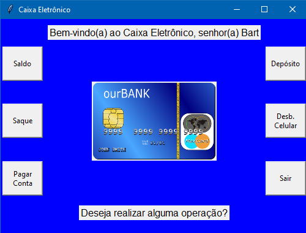

# Projeto de Caixa Eletrônico
> Projeto que simula operações feitas em um caixa eletrônico.

Este projeto consiste em uma interface gráfica que simula opções de saque, depósito, etc de um caixa eletrônico comum, escrito na linguagem PYTHON. Nele o importante foi aprender como montar as funções e como colocar cada botão executando sua operação de maneira correta e sem fechar a interface enquanto o próprio usuário quiser utilizar o programa.

---

## Módulos necessários
Foram usados os módulos TKinter, PIL e time.
TKinter: `pip install tkinter`

## Exemplos de Uso
Esse projeto é muito bom para aprender e treinar a construção de interfaces gráficas, além de funções e sequências lógicas, podendo ser adotado para pequenos outros projetos.

## Meta
Gregory Wells De Carvalho Barteles - gregorywells@gmail.com.